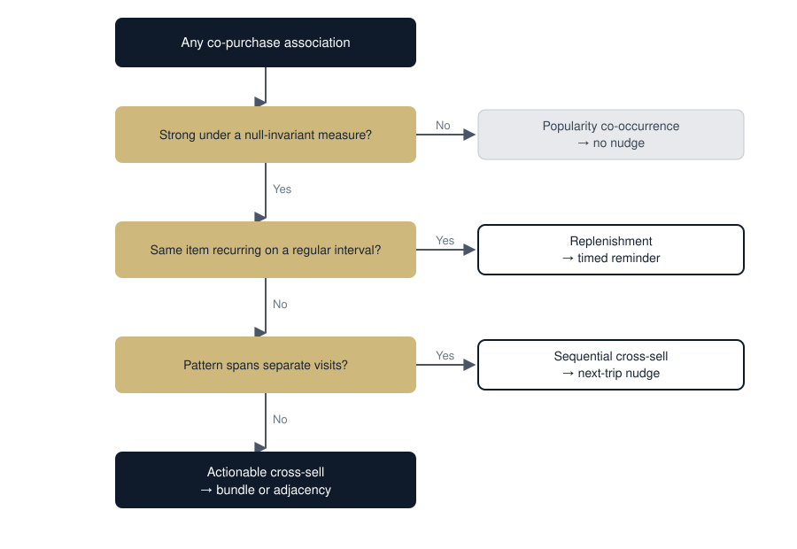

[index.md](https://github.com/user-attachments/files/32495947/index.md)

---
---

# Beyond Bought-Together
#### Actionable cross-sell versus popularity in grocery baskets

CSCI 5502 Data Mining, University of Colorado Boulder. By Bhaveeasheshwar Eswaran and Raghavendra Kumaran.

## Introduction

A grocery retailer gets only a few moments to influence a shopper. An endcap, a "frequently bought together" slot, one CRM email before the customer stops paying attention. This project asks how to spend those moments on associations that actually change a basket, instead of ones that just describe what everyone already buys.

### The problem and the decision

Retailers usually rank recommendations by how often two items show up together. The problem is that raw co-occurrence is driven by staples. Bread and milk land in thousands of baskets because both are close to universal, not because one pulls in the other. Suggesting milk to someone already buying bread changes nothing.

Frequency also mixes up two behaviors that need opposite responses. Some items get bought on a schedule, which is replenishment. Others genuinely go with a different item, which is complementary cross-sell. A system that cannot tell them apart bundles what it should be reminding about and reminds about what it should be bundling.

So the decision this project serves is a practical one. Given a fixed budget of recommendation slots and nudges, which product associations deserve one, and which kind of nudge should each one get?

### Why it matters

Recommendation space is limited and every nudge has a fatigue cost. A slot filled with an obvious staple is a slot not spent changing behavior, and an unnecessary email chips away at the attention the retailer can draw on later. Telling actionable associations apart from popularity is really a question about the return on limited attention, about spending it on changing baskets rather than narrating habits.

### Stakeholders

- **Category managers** decide shelf adjacency, endcaps, and promotional bundles. They need to know which pairs are worth physically placing together.
- **CRM and lifecycle marketing teams** send app and email nudges. They need replenishment items routed to timed reminders and cross-sell pairs routed to bundle offers, which are two different campaigns.
- **Shoppers** benefit from relevant, well-timed suggestions. They are hurt by spammy, obvious ones that train them to ignore recommendations altogether.
- **Inventory and store operations** feel the downstream effect. Bundling changes how demand correlates and how shelves are laid out, so a wrong call carries a physical cost.

### What is already known, and the gap

Market-basket analysis is well established. Apriori and FP-Growth find frequent itemsets efficiently, and the field has long known that support and confidence over-reward popular items, which is why lift and other interestingness measures exist. Retailers ship "frequently bought together" features built on exactly this machinery.

The gap is operational rather than algorithmic. Standard practice still ranks by frequency-driven measures and treats every co-occurrence as the same kind of thing. What tends to be missing, and what this project builds, is a principled split of popularity, replenishment, and genuine cross-sell, with each one mapped to the intervention it deserves and each tested for whether the pattern is real or just an artifact of a common measure.

### Routing every association to its intervention

The organizing idea is to stop producing one ranked rule list and instead sort each association by two things. First, how much stronger the pairing is than chance under a measure that popularity cannot fool. Second, what temporal shape the behavior has, whether it happens in one basket, repeats on a schedule, or plays out across separate visits. Those two axes place every association into one of four groups, and each group gets its own action.

*An association earns a nudge only if it survives the popularity test, and the kind of nudge depends on the timing of the behavior. Leaving popularity co-occurrences alone is an explicit output, not a gap.*

### Project blueprint

1. **Baseline.** Build baskets from same member and same date, then produce a plain frequency ranking as the naive benchmark the project will argue against.
2. **Strength, done properly.** Re-score pairs with a null-invariant measure and measure how much of the frequency top list is really popularity.
3. **Behavior split.** Use each member's purchase intervals to separate scheduled replenishment from complementary co-purchase.
4. **Across visits.** Mine cross-visit sequential patterns and compare them to same-basket associations.
5. **Credibility.** Check which flagged associations hold up across time, and present the routed rule set as the final evidence.

## Research Questions

Five questions, ordered so each one builds on the last. RQ2 is the primary question, and every question is answerable from the three fields the data provides, which are member, date, and item.

**RQ1. How much of the standard "frequently bought together" ranking is really about popularity rather than genuine association?** *(Descriptive and diagnostic.)* We can answer this by ranking pairs two ways, once by raw co-occurrence and once by a null-invariant strength measure, then looking at how much the two lists overlap. A small overlap puts a number on the problem the whole project rests on.

**RQ2. Which associations are actionable cross-sell, meaning strong under a null-invariant measure where the paired item is not a near-universal staple, as opposed to popularity-driven co-occurrence?** *(Relationship and pattern. Primary.)* This is the core deliverable. We can answer it by scoring candidate pairs on complementary strength and directional asymmetry, then filtering out the ones whose second item almost everyone buys anyway.

**RQ3. Among recurring purchases, can the regularity of the gaps between buys separate scheduled replenishment from complementary co-purchase, and how much of purchase volume falls in each?** *(Explanatory and behavioral.)* We can answer this per member by sorting each item's purchase dates, measuring how predictable the gaps are, and treating very regular cadences as replenishment. This is what sends an association to a timed reminder instead of a bundle.

**RQ4. Do the items a customer buys on one visit predict different items on later visits, revealing cross-sell moments that same-basket analysis misses?** *(Sequential and temporal.)* We can answer this by ordering each member's visits by date, mining the cross-visit patterns, and comparing their strength to the same pairs measured inside a single basket.

**RQ5. Which associations flagged as actionable actually hold up across time, so we can separate durable signal from sampling noise?** *(Stability and validation.)* We can answer this by mining rules on an earlier period and testing whether they still hold in a later one. The survivors form the credible set the project stands behind.

## Team

### Bhaveeasheshwar Eswaran (Bhaveeash)

An MS Data Science student at the University of Colorado Boulder, with a research background in ontology-driven NLP, knowledge graphs, and retrieval-augmented generation developed under Dr. Gerard Deepak. He has four first-author Springer publications across NLP, semantic computing, knowledge graphs, and topic modeling, and he held a MITACS Globalink fellowship at Concordia University. He holds a B.Tech in Instrumentation and Control Engineering from NIT Tiruchirappalli. On this project he leads the association-strength methodology, the replenishment and sequential analysis, and the reproducibility setup.

### Raghavendra Kumaran (Raghav)

A graduate student at the University of Colorado Boulder and a B.Tech graduate in Computer Science with a specialization in Artificial Intelligence from SRM Institute of Science and Technology. Originally from Chennai, he is drawn to solving real data problems, turning messy raw data into patterns a decision can rest on. On this project he leads data ingestion and basket construction along with the visualization work, and shares the coordination, documentation, and website tasks.

### Responsibilities

Roles overlap and will shift as the work develops.

| Area | Primary | Support |
| --- | --- | --- |
| Coordination and timeline | Shared | Shared |
| Data: ingestion, basket construction, cleaning | Shared | Shared |
| Analysis and modeling: rule mining, measure selection, replenishment and sequential methods | Bhaveeash | Raghav |
| Visualization | Raghav | Bhaveeash |
| Documentation and website | Shared | Shared |
| Reproducibility: repo structure, environment | Bhaveeash | Raghav |

## Proposal Overview

**Problem.** Grocery recommendations ranked by raw co-occurrence resurface staples and blur the line between scheduled replenishment and genuine cross-sell, which wastes scarce recommendation slots and nudges.

**Goal.** Separate actionable cross-sell from popularity and from replenishment, and route each association to the intervention it warrants.

**Data.** Groceries Dataset (Heeral Dedhia, Kaggle), about 38,765 rows, roughly 3,900 members, and around 167 items, spanning 2014 and 2015. It has three fields, which are Member_number, Date, and itemDescription. A basket is all the items that share a member and a date, since there is no checkout ID. The CSV is free, public, and small enough to run on a laptop.

**Major constraints.** Only three fields, with no price, quantity, or brand. A single retailer across 2014 and 2015. Member IDs that are re-identifiable in principle. The project works around this by leaning on temporal and sequential structure rather than product attributes, keeps its claims at the category level, and reports only at the aggregate rule level.

### What advanced since Milestone 0

The dataset and the core question are unchanged, and the refinements sharpen focus rather than widen scope. Milestone 0 proposed ranking by lift to beat popularity. Milestone 1 moves to a null-invariant measure with a read on directional asymmetry, because lift still drifts with the number of unrelated baskets and can inflate rare pairs into strong-looking rules. Replenishment went from a question to a method, using how regular each member's purchase intervals are. The separate sub-questions now sit inside a single routing of every association to an intervention, which makes doing nothing an explicit output. Temporal-holdout validation was added, so actionable now means both distinguishable and stable.

## Background and Related Work

Three strands of earlier work frame this project. The tools it uses, the measurement problem it corrects for, and the temporal extension it adds.

**The machinery, and why frequency alone falls short.** Association-rule mining was introduced by Agrawal, Imieliński, and Swami (1993) and made efficient by the Apriori algorithm (Agrawal and Srikant, 1994) and later by FP-Growth (Han, Pei, and Yin, 2000). These give the project its rule-mining tools almost for free at this data scale. The same body of work also established that support and confidence over-reward popular items, which is the exact weakness the project is built to expose instead of inherit.

**Measuring genuine association without being fooled by popularity.** Brin and colleagues (1997) introduced lift, called interest at the time, to correct confidence for base rates. Lift is not null-invariant, though, and later work catalogs measures that are, such as Kulczynski, all-confidence, cosine, and the Imbalance Ratio for asymmetry, along with guidance on choosing among them (Han, Kamber, and Pei, and Tan, Kumar, and Srivastava, 2004). This strand justifies scoring pairs with a null-invariant measure instead of frequency or lift, and reading directional asymmetry to find true complementarity.

**Behavior across visits.** Same-basket rules miss patterns that unfold over time. Sequential pattern mining (Srikant and Agrawal, 1996, and PrefixSpan by Pei and colleagues) provides methods for the pattern of one item on a visit followed by a different item on a later visit, which is what the cross-visit analysis needs from each member's ordered purchase history.

| Source | Contributes to |
| --- | --- |
| Agrawal, Imieliński, and Swami (1993), SIGMOD | Association-rule foundations, and the frequency baseline the project argues against |
| Agrawal and Srikant (1994), VLDB, Apriori | Frequent-itemset mining at project scale |
| Han, Pei, and Yin (2000), SIGMOD, FP-Growth | An efficient alternative for the baseline and candidate generation |
| Brin, Motwani, Ullman, and Tsur (1997), SIGMOD | Lift, the first correction for popularity |
| Han, Kamber, and Pei, Data Mining: Concepts and Techniques | Null-invariant measures and the null-transaction problem, the core of RQ1 and RQ2 |
| Tan, Kumar, and Srivastava (2004), Information Systems | Choosing an objective interestingness measure |
| Srikant and Agrawal (1996), EDBT, and Pei et al., PrefixSpan | Sequential pattern mining for cross-visit analysis |

## Repository

Code, data instructions, and this site live in the project repository at [github.com/bhav06-10/Beyond-Bought-Together-Actionable-Cross-sell-vs.-Popularity-in-Grocery-Baskets](https://github.com/bhav06-10/Beyond-Bought-Together-Actionable-Cross-sell-vs.-Popularity-in-Grocery-Baskets).
